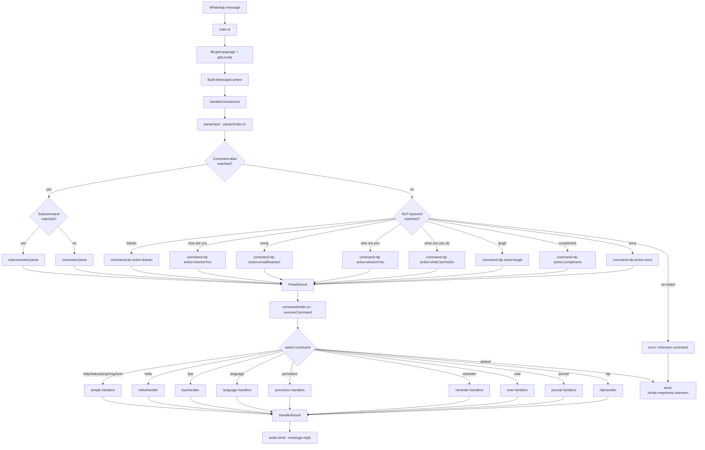
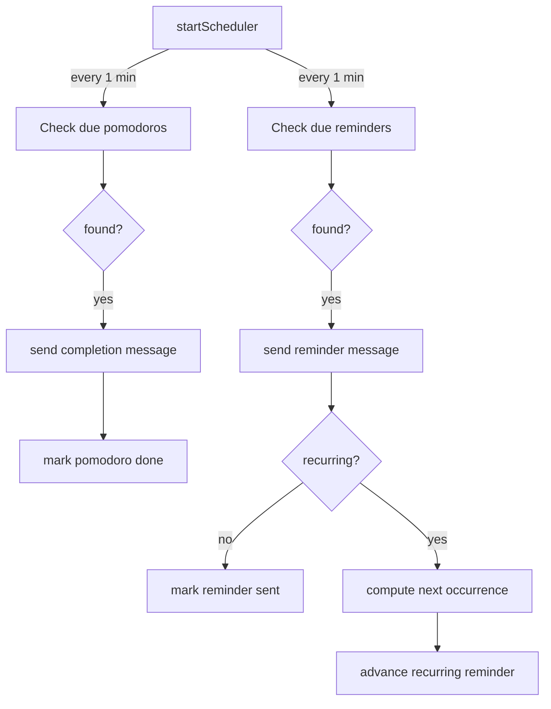

# Diagramas de Flujo

## Full message processing pipeline

```mermaid
flowchart TD
    A[WhatsApp message] --> B[main.ts]
    B --> B1[db.getLanguage + getLocale]
    B1 --> B2[Build MessageContext]
    B2 --> C[handleCommand.ts]
    C --> D[parseInput - parser/index.ts]

    D --> E{Command alias\nmatched?}
    E -->|yes| F{Subcommand\nmatched?}
    F -->|yes| G[subcommand.parse]
    F -->|no| H[command.parse]
    G --> I[ParseResult]
    H --> I

    E -->|no| J{NLP keyword\nmatched?}
    J -->|thanks| NLP1[command:nlp action:thanks]
    J -->|how are you| NLP2[command:nlp action:howAreYou]
    J -->|emoji| NLP3[command:nlp action:emojiReaction]
    J -->|who are you| NLP4[command:nlp action:whoAreYou]
    J -->|what can you do| NLP5[command:nlp action:whatCanYouDo]
    J -->|laugh| NLP6[command:nlp action:laugh]
    J -->|compliment| NLP7[command:nlp action:compliment]
    J -->|sorry| NLP8[command:nlp action:sorry]
    J -->|no match| ERR[error: Unknown command]

    NLP1 & NLP2 & NLP3 & NLP4 & NLP5 & NLP6 & NLP7 & NLP8 --> I
    ERR --> SEND_UNK[send locale.responses.unknown]

    I --> K[command/index.ts - executeCommand]
    K --> L{switch command}
    L -->|help/status/ping/msg/remi| M[simple handlers]
    L -->|hello| M2[helloHandler]
    L -->|bye| M3[byeHandler]
    L -->|language| M4[language handlers]
    L -->|pomodoro| M5[pomodoro handlers]
    L -->|reminder| M6[reminder handlers]
    L -->|note| M7[note handlers]
    L -->|journal| M8[journal handlers]
    L -->|nlp| M9[nlpHandler]
    L -->|default| SEND_UNK

    M & M2 & M3 & M4 & M5 & M6 & M7 & M8 & M9 --> R[HandlerResult]
    R --> SEND[await send - message.reply]
```

---

## Scheduler flow (pomodoros & reminders)

```mermaid
flowchart TD
    A[startScheduler] -->|every 1 min| B[Check due pomodoros]
    B --> C{found?}
    C -->|yes| D[send completion message]
    D --> E[mark pomodoro done]

    A -->|every 1 min| F[Check due reminders]
    F --> G{found?}
    G -->|yes| H[send reminder message]
    H --> I{recurring?}
    I -->|no| J[mark reminder sent]
    I -->|yes| K[compute next occurrence]
    K --> L[advance recurring reminder]
```
